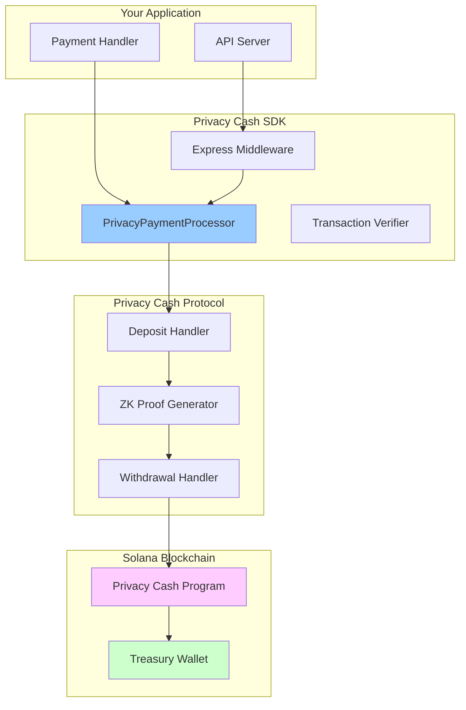
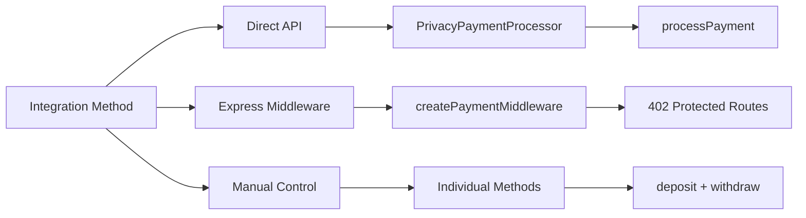
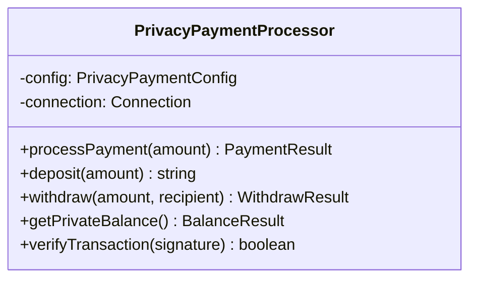
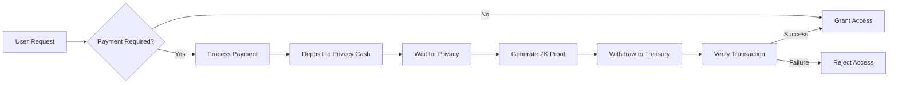
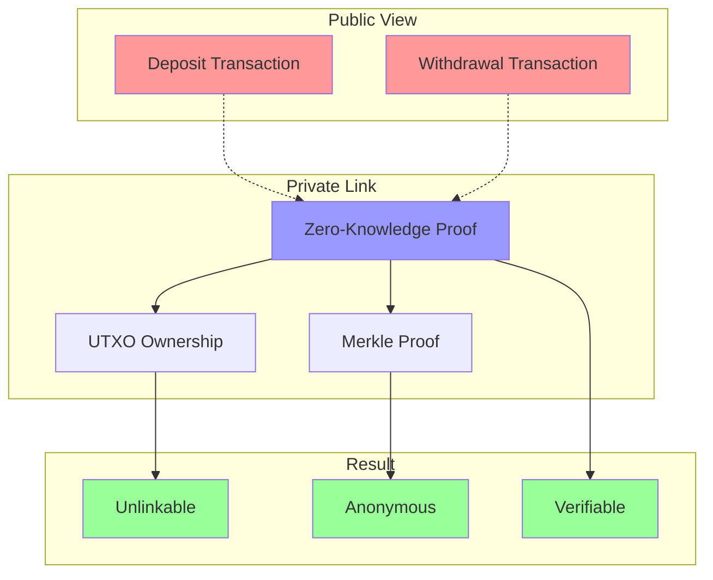
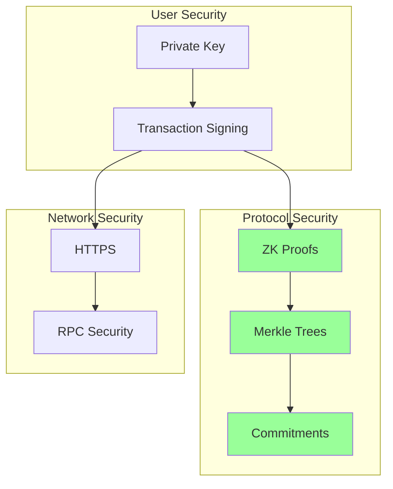
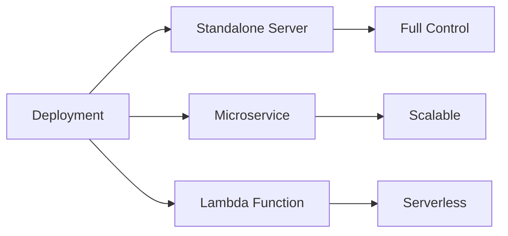
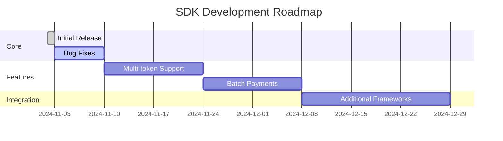

# Privacy Cash 402 SDK - Framework Overview

## What This Is

Open-source SDK for implementing privacy-enhanced 402 payments on Solana using Privacy Cash protocol.

## Architecture Diagram



## Integration Options



## File Structure

```
privacy-cash-402-sdk/
│
├── src/
│   ├── index.ts              # Core SDK
│   └── middleware.ts         # Express middleware
│
├── examples/
│   ├── basic-usage.js
│   ├── express-integration.js
│   └── manual-operations.js
│
├── dist/                     # Compiled output
│
├── README.md                 # Main documentation
├── QUICKSTART.md            # Quick start guide
├── CONTRIBUTING.md          # Contribution guidelines
├── CHANGELOG.md             # Version history
└── LICENSE                  # MIT License
```

## API Surface

### Core Class



### Data Flow



## Privacy Model



## Use Cases

| Use Case | Implementation | Complexity |
|----------|----------------|------------|
| Premium API Access | Express middleware | Low |
| Pay-per-request | Direct API | Low |
| Subscription Payments | Manual control | Medium |
| Anonymous Donations | Direct API | Low |
| Private Transfers | Manual control | Medium |

## Dependencies

```mermaid
graph TD
    A[privacy-cash-402-sdk]
    
    A --> B[privacycash@1.0.13]
    A --> C[@solana/web3.js]
    A --> D[express]
    
    B --> E[Privacy Cash Protocol]
    C --> F[Solana Blockchain]
    D --> G[HTTP Server]
    
    E --> H[ZK Circuits]
    E --> I[Merkle Trees]
    
    style A fill:#9cf
    style E fill:#fcf
```

## Performance Characteristics

| Operation | Time | Network Calls | Notes |
|-----------|------|---------------|-------|
| Deposit | 15s | 1 | Initial commitment |
| Privacy Wait | 3s | 0 | Privacy set growth |
| Proof Generation | 20s | 0 | CPU intensive |
| Withdrawal | 10s | 1 | Final transfer |
| Verification | 2s | 1 | Transaction check |
| **Total** | **50s** | **3** | Full payment cycle |

## Security Model



## Deployment Options



## Testing Strategy

| Test Type | Coverage | Tools |
|-----------|----------|-------|
| Unit Tests | SDK Functions | Jest |
| Integration Tests | API Endpoints | Supertest |
| E2E Tests | Full Payment Flow | Mainnet |
| Security Tests | ZK Proofs | Manual |

## Version Compatibility

| Component | Version | Required |
|-----------|---------|----------|
| Node.js | >= 18.0.0 | Yes |
| TypeScript | >= 5.0.0 | Dev only |
| Privacy Cash | 1.0.13 | Yes |
| Solana | Mainnet | Yes |

## Getting Started

```bash
# 1. Install
npm install privacy-cash-402-sdk

# 2. Configure
cp .env.example .env

# 3. Build (if from source)
npm run build

# 4. Run example
npm run example
```

## Support Matrix

| Feature | Status | Notes |
|---------|--------|-------|
| TypeScript | Full | Type definitions included |
| JavaScript | Full | ES2020 modules |
| Express | Full | Middleware provided |
| Fastify | Partial | Use direct API |
| Koa | Partial | Use direct API |
| Testing | Full | Examples provided |

## Community

- GitHub: Repository for issues and PRs
- Documentation: Comprehensive guides
- Examples: Multiple use cases
- License: MIT - commercial friendly

## Roadmap



## Comparison

| Feature | This SDK | Direct Integration | Alternative |
|---------|----------|-------------------|-------------|
| Setup Time | 5 min | 2+ hours | 1+ hours |
| Code Complexity | Low | High | Medium |
| Maintenance | SDK updates | Manual | Varies |
| Privacy | Full | Full | Varies |
| Documentation | Complete | DIY | Varies |
| Support | Community | None | Varies |

---

Clean, professional, diagram-heavy documentation for open-source distribution.

