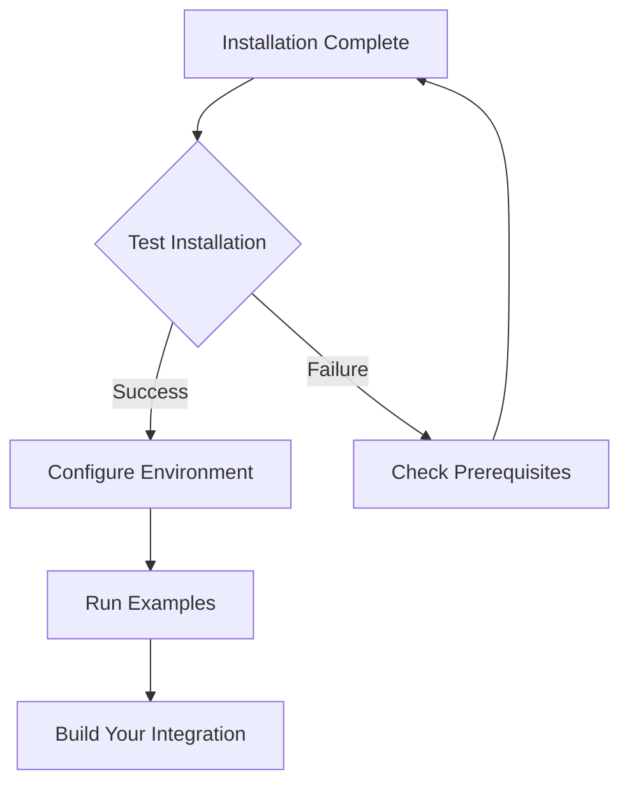
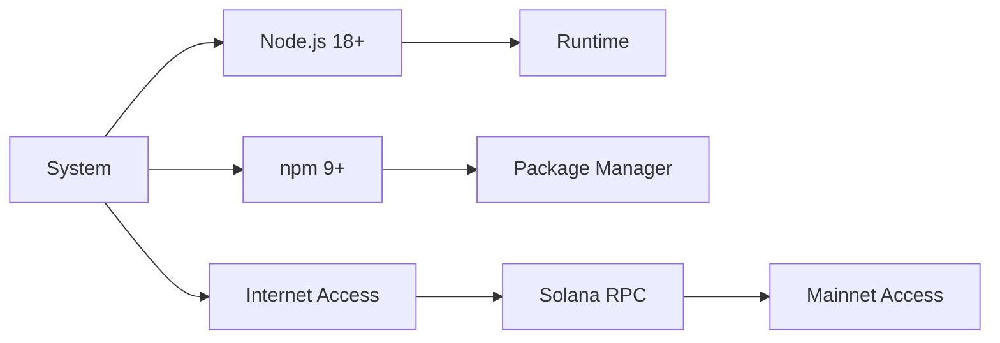

# Installation Guide

## Prerequisites

| Requirement | Version | Check |
|-------------|---------|-------|
| Node.js | >= 18.0.0 | `node --version` |
| npm | >= 9.0.0 | `npm --version` |
| Solana RPC | Mainnet | API key required |

## Installation Methods

### Method 1: npm Install (Recommended)

```bash
npm install privacy-cash-402-sdk
```

### Method 2: From Source

```bash
# Clone repository
git clone <repository-url>
cd privacy-cash-402-sdk

# Install dependencies
npm install

# Build
npm run build
```

### Method 3: Direct Download

Download from GitHub releases and install locally:

```bash
npm install ./privacy-cash-402-sdk-1.0.0.tgz
```

## Configuration

### Step 1: Environment Setup

```bash
cp .env.example .env
```

### Step 2: Configure Variables

| Variable | Description | Example |
|----------|-------------|---------|
| `SOLANA_RPC_URL` | Mainnet RPC endpoint | `https://mainnet.helius-rpc.com/?api-key=xxx` |
| `TREASURY_WALLET` | Treasury public key | `5iphs...rK7v` |
| `USER_PRIVATE_KEY` | User private key (base58) | `3j4k...89ab` |
| `PORT` | Server port | `3001` |

### Step 3: Verify Installation

```bash
# Check installation
npm list privacy-cash-402-sdk

# Run example
npm run example
```

## Post-Installation



## Troubleshooting

| Issue | Solution |
|-------|----------|
| Module not found | Run `npm install` |
| TypeScript errors | Install `typescript@>=5.0.0` |
| Build fails | Check Node.js version |
| Examples fail | Configure `.env` file |

## Next Steps

1. Read QUICKSTART.md
2. Review examples/
3. Check README.md for API documentation
4. Build your integration

## System Requirements



## Verification Commands

```bash
# Verify Node.js
node --version

# Verify npm
npm --version

# Verify package
npm list privacy-cash-402-sdk

# Test import
node -e "import('privacy-cash-402-sdk').then(console.log)"
```

## Production Checklist

- [ ] Node.js >= 18.0.0 installed
- [ ] Mainnet RPC endpoint configured
- [ ] Treasury wallet set up
- [ ] Private key management implemented
- [ ] Environment variables secured
- [ ] Error handling added
- [ ] Monitoring configured
- [ ] Testing completed

---

Installation complete. Proceed to QUICKSTART.md.

