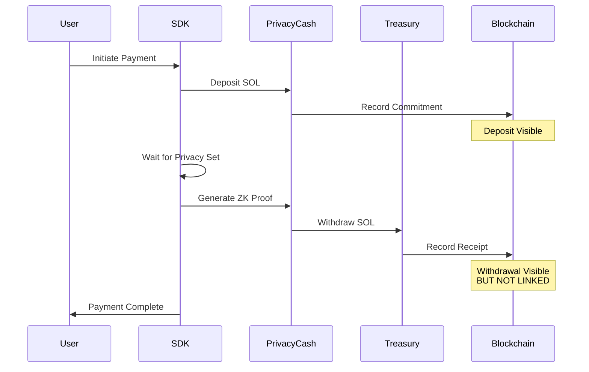
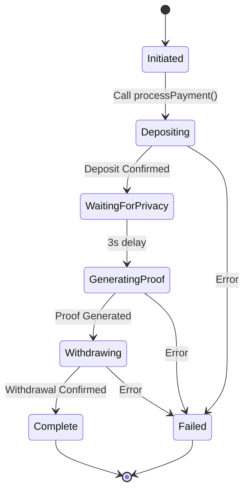
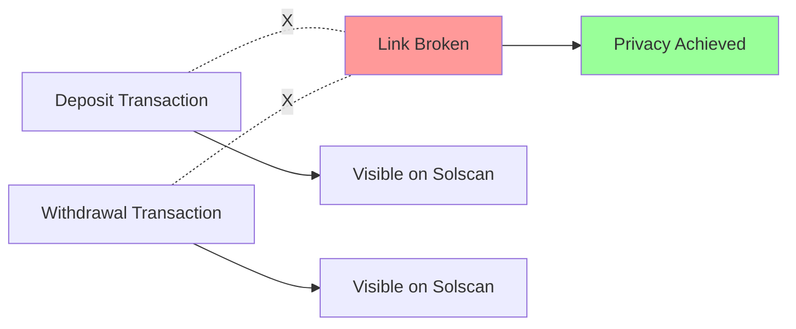
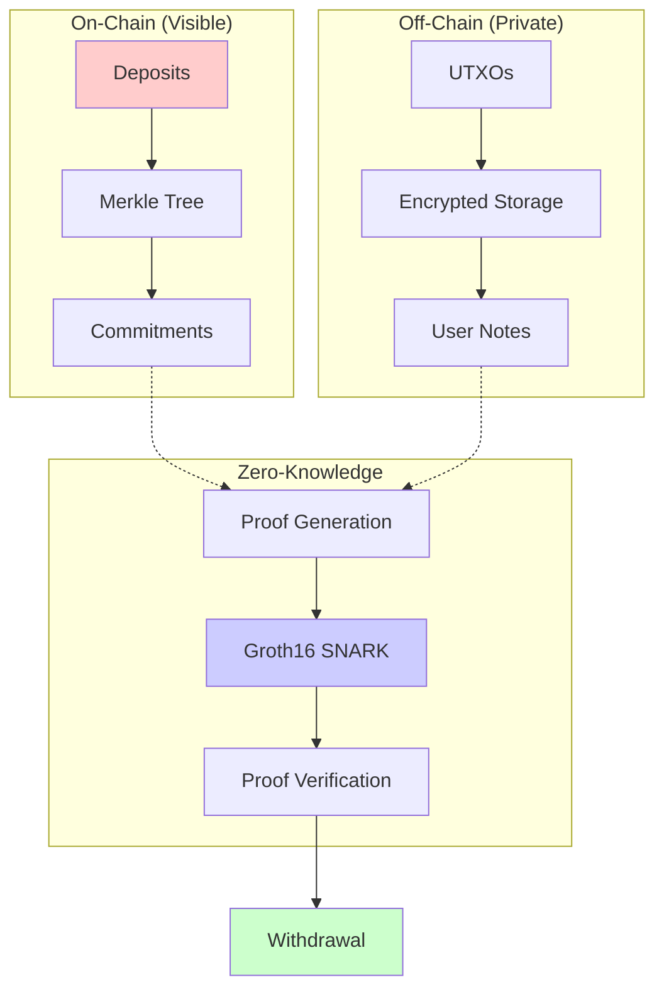

<div align="center">

# Privacy x402 SDK

### Zero-Knowledge Privacy for 402 Payments on Solana

### privacyx402.com

[](https://github.com/toursoflife/privacy402)
[](./LICENSE)
[](https://solana.com)
[](https://github.com/Privacy-Cash)
[](https://www.typescriptlang.org)
[](https://nodejs.org)

[](https://www.npmjs.com)
[]()
[]()
[]()

[Documentation](#installation) • [Quick Start](#quick-start) • [Examples](./examples) • [API Reference](#api-reference)

Break on-chain links between payers and recipients using Privacy Cash protocol.


---
## Privacy Flow



## Features

| Feature | Status | Description |
|---------|--------|-------------|
| Zero-Knowledge Proofs | Active | Groth16 ZK-SNARKs |
| Privacy Mixing | Active | UTXO-based mixing |
| 402 Payments | Supported | HTTP 402 middleware |
| Mainnet Ready | Yes | Audited protocol |
| TypeScript Support | Yes | Full type definitions |
| Express Integration | Yes | Middleware included |

## Installation

```bash
npm install privacy-cash-402-sdk
```

## Quick Start

### Basic Usage

```typescript
import { createPrivacyProcessor } from 'privacy-cash-402-sdk';

const processor = createPrivacyProcessor({
  rpcUrl: 'YOUR_SOLANA_RPC_URL',
  treasuryWallet: 'YOUR_TREASURY_WALLET',
  userPrivateKey: 'USER_PRIVATE_KEY_BASE58'
});

// Process privacy payment
const result = await processor.processPayment(0.001);

console.log('Payment sent:', result.amountSent, 'SOL');
console.log('Deposit signature:', result.depositSignature);
```

### Express Middleware

```typescript
import express from 'express';
import { createPaymentMiddleware } from 'privacy-cash-402-sdk';

const app = express();

const paymentRequired = createPaymentMiddleware({
  rpcUrl: process.env.SOLANA_RPC_URL,
  treasuryWallet: process.env.TREASURY_WALLET,
  paymentAmount: 0.001,
  getUserPrivateKey: async (req) => req.body.privateKey
});

app.get('/premium', paymentRequired, (req, res) => {
  res.json({ data: 'Premium content' });
});
```

## API Reference

### PrivacyPaymentProcessor

| Method | Parameters | Returns | Description |
|--------|-----------|---------|-------------|
| `processPayment()` | `amountSOL: number` | `Promise<PaymentResult>` | Full privacy payment flow |
| `deposit()` | `amountSOL: number` | `Promise<string>` | Deposit to Privacy Cash |
| `withdraw()` | `amountSOL: number, recipient: string` | `Promise<{amountSent, fee}>` | Private withdrawal |
| `getPrivateBalance()` | - | `Promise<BalanceResult>` | Check private balance |
| `verifyTransaction()` | `signature: string` | `Promise<boolean>` | Verify transaction |

### Configuration

```typescript
interface PrivacyPaymentConfig {
  rpcUrl: string;           // Solana RPC endpoint
  treasuryWallet: string;   // Treasury public key
  userPrivateKey: string;   // User private key (base58)
}
```

### Payment Result

```typescript
interface PaymentResult {
  success: boolean;
  depositSignature?: string;
  amountSent: number;
  fee: number;
  treasury: string;
  message: string;
}
```

## Transaction Flow



## Privacy Guarantees



### What Observers See

| Observer | Deposit | Withdrawal | Link |
|----------|---------|------------|------|
| Blockchain | User → Privacy Cash | Privacy Cash → Treasury | None |
| Solscan | Commitment Created | UTXO Consumed | None |
| Treasury | - | Payment Received | Unknown Source |
| User | Owns UTXO | - | Can Prove Payment |

## Cost Analysis

| Component | Cost | Description |
|-----------|------|-------------|
| Payment Amount | Variable | User-defined |
| Privacy Cash Fee | ~1% | Protocol fee |
| Deposit Transaction | ~0.000005 SOL | Network fee |
| Withdrawal Transaction | ~0.000005 SOL | Network fee |
| **Total** | **~1.01x + 0.00001 SOL** | Total cost |

### Example Calculation

```
Payment: 0.001 SOL
Fee (1%): 0.00001 SOL
TX Fees: 0.00001 SOL
Total: 0.00102 SOL
```

## Examples

### Manual Operations

```typescript
const processor = createPrivacyProcessor(config);

// Deposit
const depositSig = await processor.deposit(0.001);

// Check balance
const balance = await processor.getPrivateBalance();
console.log('Balance:', balance.sol, 'SOL');

// Withdraw
const result = await processor.withdraw(0.001, treasuryAddress);
```

### 402 Payment Verification

```typescript
import { createVerifyPaymentMiddleware } from 'privacy-cash-402-sdk';

const verifyPayment = createVerifyPaymentMiddleware({
  rpcUrl: process.env.SOLANA_RPC_URL,
  getSignature: (req) => req.headers['x-payment-signature']
});

app.get('/verify', verifyPayment, (req, res) => {
  res.json({ verified: true });
});
```

## System Requirements

| Requirement | Specification |
|-------------|---------------|
| Node.js | >= 18.0.0 |
| Solana RPC | Mainnet endpoint |
| Network | Mainnet-beta |
| Privacy Cash Program | 9fhQBbumKEFuXtMBDw8AaQyAjCorLGJQiS3skWZdQyQD |

## Privacy Cash Protocol



## Integration Patterns

### Pattern 1: Direct Integration

```typescript
import { PrivacyPaymentProcessor } from 'privacy-cash-402-sdk';

class PaymentService {
  private processor: PrivacyPaymentProcessor;
  
  constructor() {
    this.processor = new PrivacyPaymentProcessor(config);
  }
  
  async handlePayment(amount: number) {
    return await this.processor.processPayment(amount);
  }
}
```

### Pattern 2: Middleware Integration

```typescript
import { createPaymentMiddleware } from 'privacy-cash-402-sdk';

app.use('/api/premium/*', createPaymentMiddleware({
  rpcUrl: process.env.RPC_URL,
  treasuryWallet: process.env.TREASURY,
  paymentAmount: 0.001,
  getUserPrivateKey: keyExtractor
}));
```

### Pattern 3: Manual Control

```typescript
const processor = createPrivacyProcessor(config);

// Step 1: Deposit
await processor.deposit(amount);

// Step 2: Your custom logic here
await customValidation();

// Step 3: Withdraw
await processor.withdraw(amount, recipient);
```

## Security Considerations

| Aspect | Implementation | Risk Level |
|--------|----------------|------------|
| Private Key Storage | User responsibility | High |
| ZK Proof Generation | Privacy Cash SDK | Low |
| Transaction Signing | Local signing | Medium |
| Network Communication | HTTPS/WSS | Low |
| UTXO Management | Encrypted storage | Low |

## Audit Information

| Auditor | Date | Report |
|---------|------|--------|
| Zigtur | 2024 | Privacy Cash SDK v1.5 |
| HashCloak | 2024 | Privacy Cash Protocol |
| Kriko | 2024 | Privacy Cash Protocol |
| Accretion | 2024 | Privacy Cash Protocol |

## Troubleshooting

### Common Issues

| Issue | Cause | Solution |
|-------|-------|----------|
| "Insufficient balance" | Not enough SOL | Add SOL for payment + fees |
| "Invalid private key" | Wrong format | Use base58 encoded key |
| "Transaction timeout" | Network congestion | Retry with higher priority |
| "Proof generation failed" | Missing circuit files | Check circuit artifacts |

### Debug Mode

```typescript
const processor = new PrivacyPaymentProcessor({
  ...config,
  // Privacy Cash SDK handles debug logging
});
```

## Contributing

Contributions welcome. Submit issues and pull requests on GitHub.

## License

MIT License - see LICENSE file

---

<div align="center">

### Built with Privacy Cash SDK v1.0.13 on Solana

[](https://github.com/Privacy-Cash)
[](https://solana.com)
[]()

**Resources**

[Privacy Cash GitHub](https://github.com/Privacy-Cash) • 
[Privacy Cash SDK](https://github.com/Privacy-Cash/privacy-cash-sdk) • 
[Solana Docs](https://docs.solana.com) • 
[ZK Proofs](https://zkp.science)

**Support:** [GitHub Issues](https://github.com/toursoflife/privacy402/issues) • [Discussions](https://github.com/toursoflife/privacy402/discussions)

</div>

